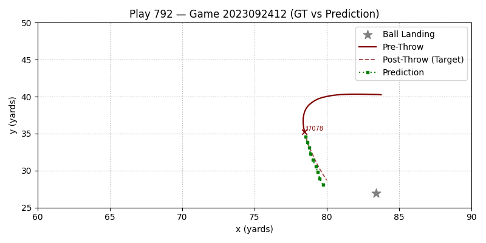

# NFL Player Tracking & Prediction
Predicting player position post-throw

Entry to NFL Big Data Bowl 2026 on Kaggle (https://www.kaggle.com/c/nfl-big-data-bowl-2026-prediction)

Model is trained on a year of player tracking data, using frames prior to the throw as input features and model context. The model output is a variable-length amount of frames for a given players field position (X,Y) from the time the ball leaves the Quarterbacks hand to when it is caught/hits the ground.

### Model Architecture
Current approach is an encoder-decoder Transformer, using pre-throw frames as the encoded hidden state. The decoder architecture is non-autoregressive following a similar approach to Facebook's DEtectionTRansformer (DETR) paper (https://ai.meta.com/research/publications/end-to-end-object-detection-with-transformers/). By using a set number of learnable queries as the decoder input, frames will be one-shot predicted using a causal mask and cross-attention with pre-throw movement.

### How to Run
Training and Inference wrappers are implemented in main.ipynb
